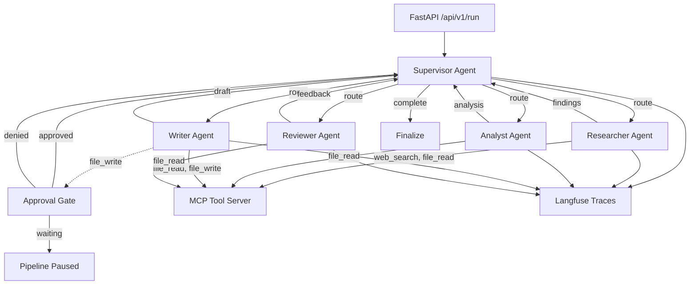

# AgentForge

Production-grade multi-agent competitive research pipeline built with LangGraph + MCP. Analyzes companies and markets through specialized, collaborating agents.

## Architecture



```
┌─────────────────────────────────────────────────────────────┐
│                     FastAPI HTTP Layer                       │
│  POST /api/v1/run  GET /status  POST /approve  GET /result  │
└──────────────────────────┬──────────────────────────────────┘
                           │
┌──────────────────────────▼──────────────────────────────────┐
│                   LangGraph StateGraph                       │
│                                                              │
│  ┌────────────┐    ┌────────────┐    ┌────────────┐         │
│  │ Supervisor │───>│ Researcher │───>│  Analyst   │         │
│  │  (router)  │<───│  (search)  │    │ (insights) │         │
│  └─────┬──────┘    └────────────┘    └────────────┘         │
│        │                                                     │
│        │           ┌────────────┐    ┌────────────┐         │
│        └──────────>│   Writer   │───>│  Reviewer  │         │
│                    │  (report)  │    │  (quality) │         │
│                    └─────┬──────┘    └────────────┘         │
│                          │                                   │
│                    ┌─────▼──────┐                            │
│                    │  Approval  │ ← Human-in-the-loop       │
│                    │    Gate    │                            │
│                    └────────────┘                            │
└──────────────────────────┬──────────────────────────────────┘
                           │
          ┌────────────────┼────────────────┐
          │                │                │
    ┌─────▼─────┐   ┌─────▼─────┐   ┌─────▼─────┐
    │ MCP Server│   │  Langfuse │   │Cost Tracker│
    │ (tools)   │   │ (traces)  │   │ (tokens/$) │
    └───────────┘   └───────────┘   └───────────┘
```

## Why LangGraph over CrewAI / AutoGen

| Criterion | LangGraph | CrewAI | AutoGen |
|-----------|-----------|--------|---------|
| **State management** | First-class `StateGraph` with typed schema — state flows through every node explicitly | Implicit state via crew memory; no typed schema | Shared context via chat history; fragile at scale |
| **Routing control** | Conditional edges with deterministic routing functions — fully inspectable | Role-based delegation; the framework decides routing | Round-robin or sequential; limited branching |
| **Human-in-the-loop** | Native interrupt/resume at any node; graph pauses and resumes cleanly | Requires custom wrapper; not a first-class concept | `human_input_mode` exists but is conversational, not checkpoint-based |
| **Observability** | Every node transition is a function call — trivial to instrument | Limited hooks; requires monkey-patching for deep tracing | Logging exists but no structured trace integration |
| **Error recovery** | Per-node retry, fallback edges, error state propagation | Basic retry; no conditional fallback paths | No built-in retry mechanism |
| **Production readiness** | Async-first, serializable state, designed for server deployments | Primarily designed for scripting/notebooks | Research-focused; not optimized for serving |

LangGraph was chosen because this system requires **deterministic routing with inspectable state transitions**, **per-node error handling**, and **human-in-the-loop checkpoints** — all of which are first-class features in LangGraph but require significant workarounds in alternatives.


